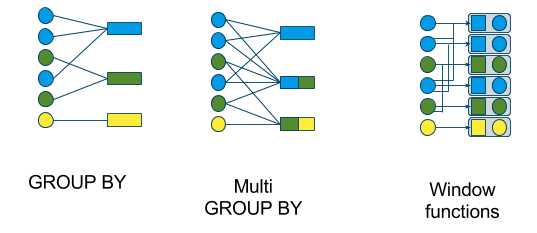

# 概述

在前面两篇中介绍了 [存储](https://github.com/dafei1288/CalciteDocTrans/blob/master/helloworld.md) 和 [UDF](https://github.com/dafei1288/CalciteDocTrans/blob/master/function.md)，然后就开始着手准备streaming了，开始走了些弯路，本以为需要构建起一个简单的流系统，才能写`streaming sql`呢，所以跑去看来几天的flink，然后再仔细研究了calcite的源码后发现，其实并不用那么麻烦，所以这个系列又能继续了。

现在，我打算用2-3章来说说streaming。

首先streaming是对表的一种补充，因为他代表着当前和未来的情况，而表则代表着过去。流是连续，流动的记录的集合，与表不同，流通常不存储再磁盘上，而是再网络上流动，在内存中保留的时间也很短。

但是与表类似，业务上也通常希望以基于关系代数的高级语言查询流，根据模式进行验证，并优化以利用可用的资源和算法。

`Calcite`的`Streaming SQL`是标准SQL的扩展，而不是另一种`SQL like`的语言。主要原因如下（翻译自calcite官方文档：

- 对于任何了解标准SQL的人来说，流式SQL都很容易学习。
- 语义清晰，无论使用表或是流，都可以返回相同的数据。
- 可以编写结合流和表的查询（或者流的历史记录，它基本上是内存中的表）。
- 许多现有的工具可以生成标准SQL。
- 如果不使用stream关键字，则返回常规标准SQL。

介绍了一下基本概念，关于流，还由一点是必须说的，就是窗口



- tumbling window (GROUP BY)
- hopping window (multi GROUP BY)
- sliding window (window functions)
- cascading window (window functions)

对于窗口和时间的一些理解，也可以看看，我的另外一篇文章《再谈Flink》


# 案例

好了，基础先说到这，下面来看看代码吧，这次其实非常简单，就可以完成`streaming`了，再一次强调，`calcite`的`streaming sql`和`flink`及`spark`的支持不同，不是api级别上的，而是支持`stream`关键字来支持流

我们已经有了前面工程的积累，这样代码量非常小的改动就可以完成了。


## bookshopStream.json

首先，我们重新定义一个模型文件，取名`bookshopStream.json`

```
{
  "version": "1.0",
  "defaultSchema": "bookshopstream",
  "schemas": [
    {
      "name": "bookshopstream",
      "tables": [
        {
          "name": "BOOK",
          "type": "custom",
          "factory": "com.dafei1288.calcite.stream.InMemoryStreamTableFactory",
          "stream": {
            "stream": true
          },
          "operand": {
            "p1": "hello",
            "p2": "world"
          }
        }
      ]
    }
  ]
}
```

这里我们对`schema`并没有过多的设置，而是直接对`tables`属性进行了设置，将`factory`指定为`com.dafei1288.calcite.stream.InMemoryStreamTableFactory`，这类后续在细讲。这里我们将表名定义为`BOOK`,意在后续使用之前案例的`Storage`。

## InMemoryStreamTableFactory

```
public class InMemoryStreamTableFactory implements TableFactory {
    @Override
    public Table create(SchemaPlus schema, String name, Map operand, RelDataType rowType) {
        System.out.println(operand);
        System.out.println(name);
        return new InMemoryStreamTable(name, Storage.getTable(name));
    }
}
```

因为在模型里，直接指定了`TableFactory`，这个类的职责就是构建`Table`表对象，其职责，有点类似之前案例里的`InMemorySchema`类的`public Map<String, Table> getTableMap()`方法。前文描述了过，指定了`"name": "BOOK"`，所以，在这里代码执行的结果就是加载了`BOOK`表。

## InMemoryStreamTable

```
public class InMemoryStreamTable extends InMemoryTable implements StreamableTable {
    public InMemoryStreamTable(String name, Storage.DummyTable it) {
        super(name, it);
    }

    @Override
    public Table stream() {
        System.out.println("streaming .....");
        return this;
    }
}
```

这里，为了能复用之前的存储逻辑，所以直接继承了`InMemoryTable`,所以，这个实现，其实底层并不是一个彻底的`streaming`实现，而是和之前案例一直的内存实现，但是这样就可以通过stream关键字，来进行sql查询了。

## 测试

```
public class TestStreamJDBC {
    public static void main(String[] args) {
        try {
            Class.forName("org.apache.calcite.jdbc.Driver");
        } catch (ClassNotFoundException e1) {
            e1.printStackTrace();
        }
        System.setProperty("saffron.default.charset", ConversionUtil.NATIVE_UTF16_CHARSET_NAME);
        System.setProperty("saffron.default.nationalcharset",ConversionUtil.NATIVE_UTF16_CHARSET_NAME);
        System.setProperty("saffron.default.collation.name",ConversionUtil.NATIVE_UTF16_CHARSET_NAME + "$en_US");

        Properties info = new Properties();
        String jsonmodle = "E:\\working\\others\\写作\\calcitetutorial\\src\\main\\resources\\bookshopStream.json";
        try {
            Connection connection =
                    DriverManager.getConnection("jdbc:calcite:model=" + jsonmodle, info);
            CalciteConnection calciteConn = connection.unwrap(CalciteConnection.class);

            ResultSet result = null;

            Statement st = connection.createStatement();

            st = connection.createStatement();
            //where b.name = '数据山'
            result = st.executeQuery("select stream * from BOOK as b ");
            while(result.next()) {
                System.out.println(result.getString(1)+" \t "+result.getString(2)+" \t "+result.getString(3)+" \t "+result.getString(4));
            }
            result.close();
        }catch(Exception e){
            e.printStackTrace();
        }

        }
}
```

`select stream * from BOOK as b`这里撰写了一个简单的SQL，并使用了`stream`关键字，结果如下。

```
{p1=hello, p2=world, modelUri=E:\working\others\写作\calcitetutorial\src\main\resources\bookshopStream.json, baseDirectory=E:\working\others\写作\calcitetutorial\src\main\resources}
BOOK
streaming .....
scan ...... 
1 	 1 	 数据山 	 java
2 	 2 	 大关 	 sql
3 	 1 	 lili 	 sql
4 	 3 	 ten 	 c#
```

那么对于一个非stream表，使用stream关键字，会怎么样呢？那么我们会得到一个异常

> ERROR: Cannot convert table 'xxx' to a stream


# 结尾

目前只是完成了最基础的查询，代码已提交到demo仓库

TBD 